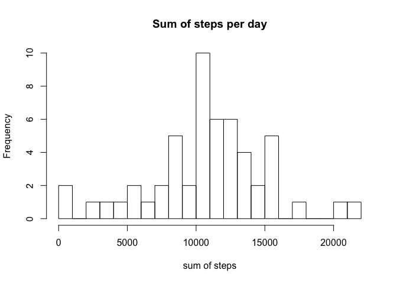
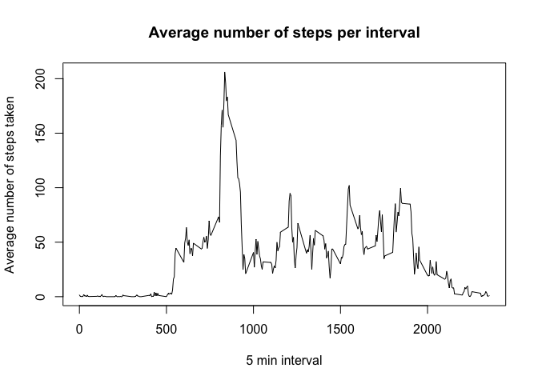
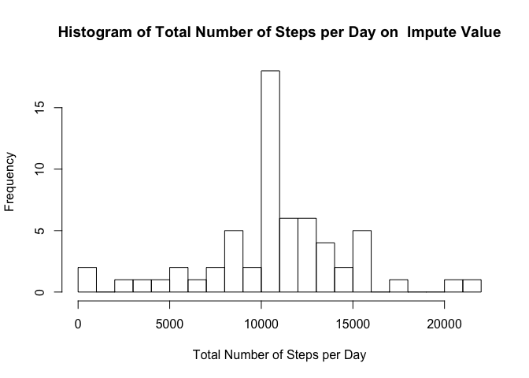
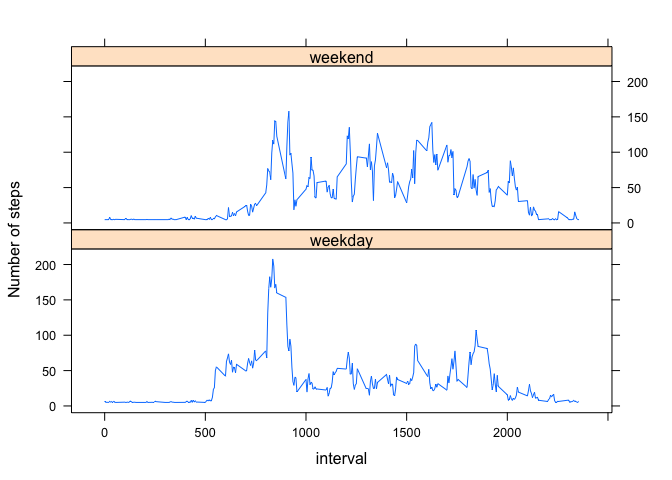

# Reproducible Research Week1 Assignment
Mia Rong  
February 11, 2016  

## Loading and preprocessing the data

1. Load the data  
2. Change the class of date from factor to date


```r
filename <- unzip("activity.zip")
data <- read.csv(filename, stringsAsFactors = FALSE)
data$date <- as.Date(data$date, format = "%Y-%m-%d")
```

## What is mean total number of steps taken per day?
1. Calculate the total number of steps taken per day
2. If you do not understand the difference between a histogram and a barplot, research the difference between them. Make a histogram of the total number of steps taken each day
3. Calculate and report the mean and median of the total number of steps taken per day

```r
nd <- data[!is.na(data$steps) == TRUE,]
ad <- aggregate(nd$steps,by=list(nd$date),sum) 
names(ad) <- c("date","sum_steps")
hist(ad$sum_steps, breaks =20, main = "Sum of steps per day", xlab = "sum of steps")
```



```r
mean(ad$sum_steps)
```

```
## [1] 10766.19
```

```r
median(ad$sum_steps)
```

```
## [1] 10765
```

## What is the average daily activity pattern?
1. Make a time series plot (i.e. 𝚝𝚢𝚙𝚎 = "𝚕") of the 5-minute interval (x-axis) and the average number of steps taken, averaged across all days (y-axis)
2. Which 5-minute interval, on average across all the days in the dataset, contains the maximum number of steps?

```r
ad<- aggregate(nd$steps,by=list(nd$interval),mean) 
names(ad) <- c("interval","mean_steps")
plot(ad$interval, ad$mean_steps, type ="l", xlab = "5 min interval", ylab = "Average number of steps taken", main = "Average number of steps per interval")
```



```r
ad$interval[ad$mean_steps == max(ad$mean_steps)]
```

```
## [1] 835
```

## Imputing missing values

Note that there are a number of days/intervals where there are missing values (coded as 𝙽𝙰). The presence of missing days may introduce bias into some calculations or summaries of the data.

1. Calculate and report the total number of missing values in the dataset (i.e. the total number of rows with 𝙽𝙰s)
2. Devise a strategy for filling in all of the missing values in the dataset. The strategy does not need to be sophisticated. For example, you could use the mean/median for that day, or the mean for that 5-minute interval, etc.
3.Create a new dataset that is equal to the original dataset but with the missing data filled in.
4. Make a histogram of the total number of steps taken each day and Calculate and report the mean and median total number of steps taken per day. Do these values differ from the estimates from the first part of the assignment? What is the impact of imputing missing data on the estimates of the total daily number of steps?

##### Imputing NA with the average of the steps value made the histogram less skewed. The frequency of the sum of steps per day for the range of 10,000 to 11,000 is now peaked at 15, 5 higher than earlier chart with no NA value(10). #####

##### Strategy of imputing NA is to provide mean of the value


```r
sum(is.na(data))
```

```
## [1] 2304
```

```r
data_trans <- transform(data, steps = ifelse(is.na(steps), mean(steps, na.rm=TRUE), steps))
```


```r
sum_date<-tapply(data_trans$steps, data_trans$date, sum)
hist(sum_date, breaks = 20, main = "Histogram of Total Number of Steps per Day on  Impute Value", xlab = "Total Number of Steps per Day", ylab = "Frequency")
```



```r
mean(sum_date)
```

```
## [1] 10766.19
```

```r
median(sum_date)
```

```
## [1] 10766.19
```

## Are there differences in activity patterns between weekdays and weekends?

Note that there are a number of days/intervals where there are missing values (coded as 𝙽𝙰). The presence of missing days may introduce bias into some calculations or summaries of the data.

For this part the 𝚠𝚎𝚎𝚔𝚍𝚊𝚢𝚜() function may be of some help here. Use the dataset with the filled-in missing values for this part.

1. Create a new factor variable in the dataset with two levels – “weekday” and “weekend” indicating whether a given date is a weekday or weekend day.

2. Make a panel plot containing a time series plot (i.e. 𝚝𝚢𝚙𝚎 = "𝚕") of the 5-minute interval (x-axis) and the average number of steps taken, averaged across all weekday days or weekend days (y-axis). See the README file in the GitHub repository to see an example of what this plot should look like using simulated data.


```r
data_trans$day <- weekdays(as.Date(data_trans$date))
data_trans$week[(data_trans$day == "Monday")|(data_trans$day == "Tuesday")|(data_trans$day == "Wednesday")|(data_trans$day == "Thursday")|(data_trans$day == "Friday")] <-"weekday"
data_trans$week[(data_trans$day == "Saturday")|(data_trans$day == "Sunday")]  <-"weekend"

library(plyr)
library(lattice)
final <- ddply(data_trans, c("interval", "week"), function(x) apply(x[1], 2, mean))
xyplot(steps~interval | week, data= final, layout = c(1,2), type = "l", ylab= "Number of steps")
```


